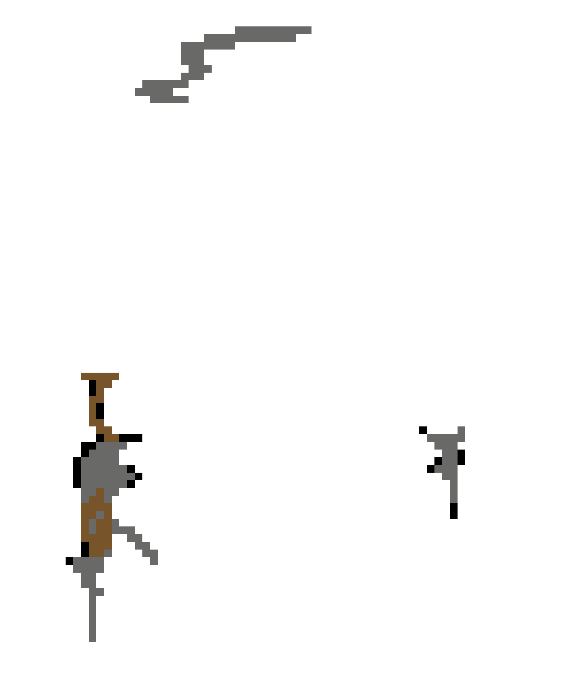

# 2D Action Game – Spy Escape

## 概要
本作は2Dアクションゲームです。  
プレイヤーは他国に潜入していたスパイエージェントとなり、正体が露見した状況で敵軍の攻撃を受けながら脱出地点を目指します。  
四方八方から現れる敵ヘリコプター（突撃してくる神風ヘリを含む）を回避・撃破し、自国の軍用ヘリに回収されればクリアとなります。

---

## 操作方法
- **W / A / S / D**：移動  
- **マウス移動**：照準  
- **左クリック**：射撃  
- **Shift**：急ダッシュ  
- **Space**：ジャンプ  
- **Space + 壁**：壁ジャンプ  

※ 壁に向かってジャンプし、接触した瞬間に再ジャンプすることで壁ジャンプが可能  
※ 移動キーの入力タイミングによって、より高く登ることができます  

<!-- Wall Jump Loop Video -->
<video src="./Assets/Art/UI/Movement Explaination/wall jump video.mp4" autoplay loop muted playsinline width="600"></video>

---

## 開発環境
- **ゲームエンジン**：Unity  
- **Unity バージョン**：6000.2.6f2  
- **ゲームタイプ**：2D  
- **使用言語**：C#  

---

## 備考
本リポジトリにはゲーム本体のプロジェクトデータが含まれています。  
画像・演出・ゲームロジックはすべて自作です。
